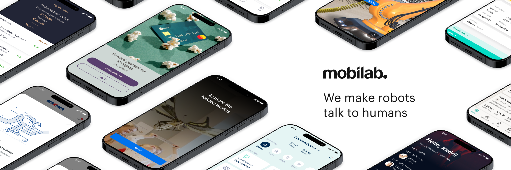

# Mobi Lab Components (the View-based legacy library)

--

**Notice of depreciation:** 

**As both Mobi Lab and Google with their Android platform are focusing more and more on Compose-based UI then the development of this View-based library is stopped and the library is considered as depreciated.** Prefer to use https://github.com/LabMobi/labcomponents-compose instead.

--

Mobi Lab Components (LabComponents) help developers use Mobi Lab's design system's components on the Android platform. This is the View-based library. For Compose, see https://github.com/LabMobi/labcomponents-compose.

Maven Central artifact available from https://central.sonatype.com/search?q=mobi.lab.labcomponents

```groovy
implementation 'mobi.lab.labcomponents:labcomponents:x.y.z' // Check the latest version from Maven Central
```

These components are based on [Material Components for Android](https://github.com/material-components/material-components-android).

## Compatible versions

| Lab Components   | Material Components |
|------------------|:--------------------|
| 0.0.3            | 1.8.0               |
| 0.0.8 .. 0.0.10  | 1.10.0              |
| 0.0.11 .. 0.0.13 | 1.11.0              |
| 0.0.14 ..        | 1.12.0              |

## Description

The library contains a ready-to-use implementation of the components from Mobi Lab's P42 design system. Mobi Lab's P42 design system allows teams to focus on solving business problems instead of reinventing basic design system and UI components at the design and implementation phases.

The project consists of the component library in `lib` module and the components demo application in `app-demo` module.

## Links

- [Upcoming tasks](docs/upcoming_tasks.md)
- [Directory Structure](docs/directory_structure.md)
- [Resource Visibility](docs/resource_visibility.md)
- [Contributing](docs/contributing.md)
- [Release Guide](RELEASE_GUIDE.md)
- [Material Components for Android](https://github.com/material-components/material-components-android) (external)

## List of components

-   [Colors](docs/components/colors.md)
-   [Button](docs/components/button.md)
-   [TextField](docs/components/textfield.md)
-   [Theme](docs/components/theme.md)
-   [Toolbar](docs/components/toolbar.md)
-   [Typography](docs/components/typography.md)


# Upcoming tasks

See [Upcoming tasks](docs/upcoming_tasks.md)
